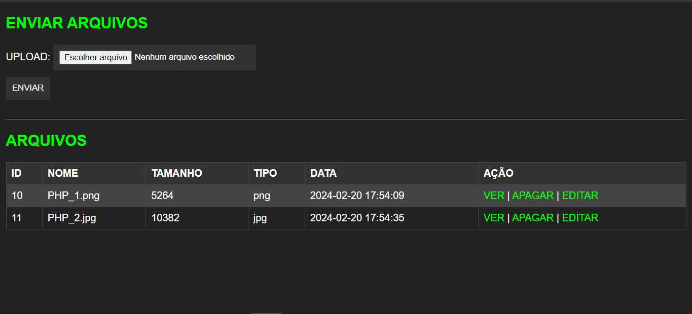
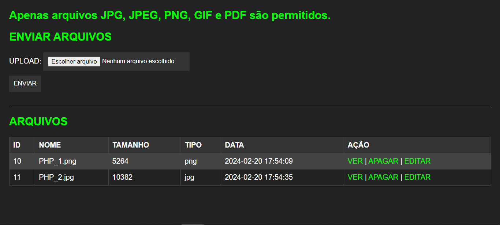
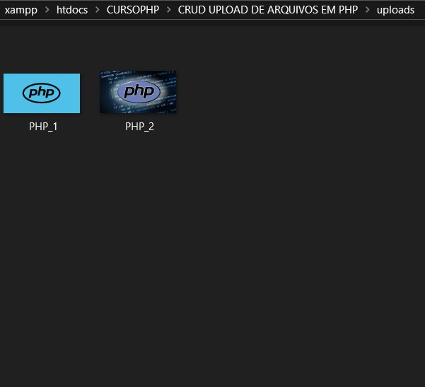

# CRUD UPLOAD DE ARQUIVOS EM PHP
👨‍🏫CRUD DE MULTIMIDIAS EM HTML, CSS, PHP E MYSQL.

 <br> <br> 
 <br> <br>
 <br> <br>
 <br> <br>
 <br> <br>
 <br> 

## DESCRIÇÃO:
O aplicativo [CRUD](./CRUD.md) de upload de arquivos em PHP e MySQL é uma ferramenta simples, mas poderosa, que permite aos usuários gerenciar facilmente o armazenamento e a manipulação de arquivos em um sistema web. Com este aplicativo, os usuários podem realizar uma variedade de tarefas relacionadas a arquivos, incluindo upload, visualização, edição e exclusão, tudo através de uma interface amigável e intuitiva:

1. **Upload de Arquivos**:
   - Os usuários podem fazer upload de arquivos para o sistema através de um formulário na página principal do aplicativo.
   - O formulário inclui um campo de seleção de arquivo que permite aos usuários escolher o arquivo desejado em seu dispositivo local.
   - Após o envio do arquivo, ele é transferido para o servidor e armazenado em um diretório específico, enquanto os detalhes do arquivo (como nome, tamanho e tipo) são registrados no banco de dados MySQL.

2. **Listagem de Arquivos**:
   - Todos os arquivos que foram enviados para o sistema são listados em uma tabela na página principal do aplicativo.
   - A tabela exibe detalhes importantes de cada arquivo, como ID, nome, tamanho, tipo e data de upload.
   - Os usuários podem visualizar rapidamente todos os arquivos que foram enviados e suas informações associadas.

3. **Visualização de Arquivos**:
   - Os usuários têm a opção de visualizar arquivos individualmente clicando em um link de visualização ao lado de cada arquivo na tabela.
   - Ao clicar no link, os usuários podem ver uma visualização do arquivo (por exemplo, uma imagem) na mesma página ou em uma nova janela, dependendo do tipo de arquivo.

4. **Edição de Arquivos**:
   - Os usuários podem editar os detalhes dos arquivos, como nome, diretamente na tabela de listagem de arquivos.
   - Isso é possível através de um link de edição ao lado de cada arquivo, que redireciona os usuários para uma página de edição específica.

5. **Exclusão de Arquivos**:
   - Os usuários têm a capacidade de excluir arquivos do sistema clicando em um link de exclusão ao lado de cada arquivo na tabela.
   - Ao clicar no link, uma confirmação pode ser solicitada para evitar exclusões acidentais. Depois de confirmada, a exclusão do arquivo é realizada.

6. **Interface Responsiva**:
   - A interface do aplicativo é projetada para ser responsiva, garantindo uma experiência de usuário consistente em diferentes dispositivos e tamanhos de tela.
   - Elementos de design são adaptáveis e organizados de forma a facilitar a navegação e a interação do usuário.

Esses recursos combinados proporcionam aos usuários uma maneira eficiente de fazer upload, gerenciar e manipular arquivos dentro do sistema, permitindo uma experiência de usuário intuitiva e fácil de usar.

## COMO USAR?
### BAIXANDO O PROJETO:
* Clone o repositório para o seu sistema local:

```bash
git clone https://github.com/VILHALVA/CRUD-UPLOAD-DE-ARQUIVOS-EM-PHP.git
```

* Navegue até o diretório do projeto.

```bash
cd CRUD-UPLOAD-DE-ARQUIVOS-EM-PHP
```

* Descompacte o arquivo ZIP (se você baixou manualmente):

```bash
unzip CRUD-UPLOAD-DE-ARQUIVOS-EM-PHP.zip
```

### EXECUTANDO O PROJETO:
1. **Importar o `DATABASE.sql`**
   - Como você já baixou esse projeto com uma foto de modelo dentro de `CODIGO/uploads/PHP.png`, é de suma importância que você import o database. 
   
   - Aqui estão as instruções para importar um arquivo SQL para o MySQL via shell e via phpMyAdmin:

   **Via Shell (linha de comando):**

   1. Abra o terminal ou prompt de comando.
   2. Certifique-se de que o servidor MySQL esteja em execução. Se não estiver, inicie o servidor MySQL usando o comando apropriado para o seu sistema operacional.
   3. Navegue até o diretório onde o arquivo `DATABASE.sql` está localizado, usando o comando `cd` (change directory).
   4. Use o utilitário `mysql` para importar o arquivo SQL para o MySQL. O comando será semelhante ao seguinte:

      ```bash
      mysql -u username -p upload < DATABASE.sql
      ```

      Substitua `username` pelo seu nome de usuário MySQL.
      
      Você será solicitado a inserir a senha após executar este comando.

   **Via phpMyAdmin:**

   1. Abra o phpMyAdmin em seu navegador. O URL pode variar dependendo da sua configuração, mas geralmente é algo como `http://localhost/phpmyadmin`.
   2. Faça login com suas credenciais de usuário MySQL.
   3. No painel do phpMyAdmin, clique no banco de dados para o qual deseja importar os dados ou crie um novo banco de dados, se necessário.
   4. Depois de selecionar o banco de dados, clique na guia "Importar" na parte superior da página.
   5. Na seção "Arquivo a ser importado", clique em "Escolher arquivo" e selecione o arquivo `DATABASE.sql` em seu computador.
   6. Clique em "Executar" ou "Importar" para iniciar o processo de importação.
   7. Aguarde até que o phpMyAdmin conclua a importação. Isso pode levar algum tempo, dependendo do tamanho do arquivo SQL e do desempenho do seu servidor.

2. **Configuração do PHP:**

   - Abra o arquivo `config.php` e ajuste as configurações do banco de dados:

     ```php
     $servername = "localhost";
     $username = "seu_usuario";
     $password = "sua_senha";
     $dbname = "UPLOAD";
     ```

3. **Executando o Aplicativo:**

   - Coloque os arquivos em um servidor web compatível com PHP (por exemplo, XAMPP, WAMP, LAMP).
   - Acesse o formulário no navegador visitando `http://localhost/CODIGO/index.php`.

## NÃO SABE?
- Entendemos que para manipular arquivos em `HTML`, `CSS` e outras linguagens relacionadas, é necessário possuir conhecimento nessas áreas. Para auxiliar nesse aprendizado, oferecemos cursos gratuitos disponíveis:
* [CURSO DE HTML E CSS](https://github.com/VILHALVA/CURSO-DE-HTML-E-CSS)
* [CURSO DE PHP](https://github.com/VILHALVA/CURSO-DE-PHP)
* [CURSO DE MYSQL](https://github.com/VILHALVA/CURSO-DE-MYSQL)
* [CURSO DE MYSQL COM PHP](https://github.com/VILHALVA/CURSO-DE-MYSQL-COM-PHP)
* [CONFIRA MAIS CURSOS](https://github.com/VILHALVA?tab=repositories&q=+topic:CURSO)

## CREDITOS:
- [PROJETO CRIADO PELO VILHALVA](https://github.com/VILHALVA)


